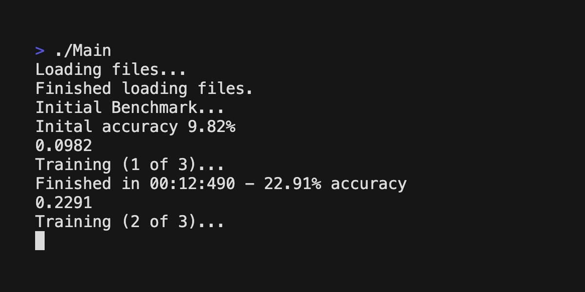

# CPP Neural Network

A simple neural network library written entirely from scratch using c++. The library uses gradient decent to optimize its model. MNIST was used to test the model.

With 40 training epocs and a learning rate of 0.001, the neural network achieves accuracies between 80 and 90 percent!
